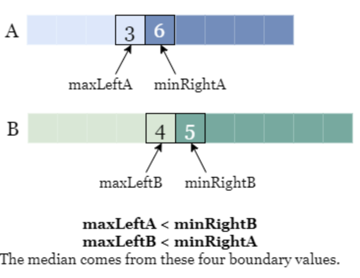

### I Don't Want to Do the Blackjack Follow Up Yet
So I decided to take a breather and do a leetcode problem. This is the 4<sup>th</sup> problem that I've finished and I almost first tried it. I probably was taking more care because the problem was labeled as hard so I should try to keep that focus no matter the difficulty level. I also tried to do this problem using <b>C++</b> to practice that language.

### Median of 2 Sorted Arrays
The problem was framed like this:

```
Given two sorted arrays nums1 and nums2 of size m and n respectively, 
return the median of the two sorted arrays.
The overall run time complexity should be O(log (m+n)).

Example 1:

Input: nums1 = [1,3], nums2 = [2]
Output: 2.00000
Explanation: merged array = [1,2,3] and median is 2.

Example 2:

Input: nums1 = [1,2], nums2 = [3,4]
Output: 2.50000
Explanation: merged array = [1,2,3,4] and median is (2 + 3) / 2 = 2.5.
```

I started working through the problem and broke it down into two steps:
1. Put the contents of the two arrays into a new array while keeping the ordering
2. Determine the middle index of the merged arary:
    * if the array size is odd numbered, the middle index will be what needs to be returned
    * if it is even numbered, you have to get the average of the two middle indicies

It didn't seem that bad, so I got to work. The problem gives you the class called solution with the function declaration with inputs, and the rest I had to fill out. I copied provided code to my VS code editor because I like the LSP error checking so I avoid simple syntax errors.

```c++
#include<vector>
#include<iostream>
using namespace std;

class Solution {
public:
    double findMedianSortedArrays(vector<int>& nums1, vector<int>& nums2) {
        // 1 merge arrays while sorting
        // 2 calculate the middle index if it exists to return it as a double
        // 2.5 if it is an even number array, calculate the average of the 
        // middle 2 numbers to return

        vector<int> merge_vector;
        int i = 0;
        int j = 0;

        while (i < nums1.size() || j < nums2.size()) {
            if (i == nums1.size()) {
                merge_vector.push_back(nums2[j]);
                j++;
            } else if (j == nums2.size()) {
                merge_vector.push_back(nums1[i]);
                i++;
            } else if (nums1[i] > nums2[j]) {
                merge_vector.push_back(nums2[j]);
                j++;
            } else {
                merge_vector.push_back(nums1[i]);
                i++;
            }
        
        }

        int merge_size = merge_vector.size();
        if (merge_size % 2 == 0){
            double out = (static_cast<double>)
                (merge_vector[merge_size/2] 
                + merge_vector[(merge_size/2) - 1]) 
                / 2;
            return out;
        } else {return (static_cast<double>)(merge_vector[merge_size/2]);}
    }
};
```

So, I did what I planned. In the first block above (lines 12-14), I defined a new vector (c++ array list/dynamic array) `merge_vector` for the merged list and specified two counters--`i` and `j` for `num1` and `num2` respectively--that I use to iterate through both given vectors as long as I haven't seen every index in at least one of them (line 16). Then, I loop while my counters are both not out-of-bounds for my given vectors. In each loop, I check if I am still in bounds of the given vectors (lines 17-22); if `i` or `j` are equal to the size of their assigned vector, then the i<sup>th</sup>/j<sup>th</sup> index would be out of bounds, meaning that I looked at every index of that vector. If that condition is true, we just need to put the value at the index of the other list into our merge_vector (lines 18/21) and advance that index to look at the next value (lines 19/22) if needed. 

But that's not really what we expect to be the normal case, we expect that we will have to compare the values at two indicies in both lists. That's what the 3<sup>rd</sup> and 4<sup>th</sup> if cases check (lines 23-28). Which ever value at the compared indices is smaller gets put into the merge_vector (lines 24/27) and we move on to the next index (lines 25/28) for the vector that we just put into the merge_vector.

Then once all that's done, we need to calculate the size of the merge_vector which we can do with a method built in to vectors `.size()` (line 33). Then we check if that size is even or odd by using the modulo operator `%` and seeing if there's a remainder if we do a `%2` check (line 34). If there is no remainder, the number is even and we have to get the two middle values and average them, changing the data type from `int` (counting numbers) to `double` (numbers which can have decimals). This is where I made my mistake, because I accidently was getting the value of the larger middle index and the value after, instead of the one before. I had added 1 instead of subtracting 1 from the middle index because I didn't modle it in my head right.

If it's odd, all you have to do is get the middle value by its index and return it.

### Grading My Code

So, it ended up working, but my submission was not that good! It was only better than 40% of submissions in speed and better than 20% of submissions by memory usage. I don't want to be mediocre so let's compare my approach to better results. First, my code must read through both vectors which were the input which immediately makes its runtime linear: O(n+m). In the question phrasing it did say that I should be O(log (n+m)) which I completely ignored. The question also lets us know that the arrays are sorted, which I did use in my thinking.

The best solutions apply a binary search algorithm. A binary search's runtime is O(log n) on one array/list, so on two we can find a way to get it to O(log (n+m)). In general, a binary search can only be applied on a sorted array/list because that sorting allows us to know roughly where the target is relative to a value that we check. To get O(log n) runtime, the goal is to split the array/list in half on every check, discarding the half that we know the target is not in.

#### Binary Search 1

In this problem, our target is what would be the value of the middle index in an array which is the combination of two ordered arrays that we're given. Logically, we can assume that one array has a left half which is smaller than all of the numbers in the right half of the other. Let's say that the array with the smaller left half is called `A` and the array with larger right half is called `B`.

First, we're looking for the value of the middle index of a sorted `A+B` if the the size of `A` and `B` add together to an odd number. If `A` has a size of `n` and `B` has a size of `m`, that index in a 0-indexed array is can be called `k` and is mathematically, not including a remainder/rounding down:

$$ 
\frac{n + m - 1}{2} = k
$$

If $$ n + m $$ is even, we need the `k` and `k-1` indicies and we take the average of their values. Regardless, we want to set our target to be the index `k` for the binary search. However, if we do this recursively like the given solution implies, your `k` will change as you throw away the half you don't want and work on a new set of arrays in a new function call. But we can do it iteratively with the same base case: checking if we've exhausted one array. We need to create a function which will get the `kth` values that we specify after checking if `n + m` is even or odd. We can discard half of the given arrays after determining which side the desired index is in by updating pointer values for the start and end of `A` or `B`. Initially, we start at the 0<sup>th</sup> index for both arrays and end at the last index `.size() - 1`. We can remove half of the array by knowing what the middle index is. If `k` is larger than the middle index we can discard the left half by setting the array's start to be `mid + 1` and calculate a new mid as we keep going. We know that we get to the `kth` index when we have only 1 index in 1 of the arrays left, so we return the value of that index. We determine when we have exhausted one of the array's by noting if the end pointer of one array has been moved to a smaller index than the start of the array. Here is the implementation below:

```c++
#include<vector>
#include<iostream>
using namespace std;

class Solution {
public:
    double findMedianSortedArrays(vector<int>& A, vector<int>& B) {
        int n = A.size();
        int m = B.size();
        int nm = n + m;

        // if there's a remainder, nm is odd.
        if (nm % 2) {
            return 1.0 * get_kth_value(A, B, nm / 2, 0, na - 1, 0, nb - 1);
        } else {
            return 1.0 *
                   (get_kth_value(A, B, nm / 2 - 1, 0, na - 1, 0, nb - 1) +
                    get_kth_value(A, B, nm / 2, 0, na - 1, 0, nb - 1)) /
                   2;
        }
    }

    int get_kth_value(vector<int>& A, vector<int>& B, int k, 
                int aStart, int aEnd, int bStart, int bEnd) {
        while (true) {
            // Base cases: if one array segment is empty
            if (aEnd < aStart) {
                return B[k - aStart];
            }
            if (bEnd < bStart) {
                return A[k - bStart];
            }

            // Get middle indices and values
            int a_mid_idx = (aStart + aEnd) / 2;
            int b_mid_idx = (bStart + bEnd) / 2;
            int a_value = A[a_mid_idx];
            int b_value = B[b_mid_idx];

            // If k is in the right half of A + B, discard the left half
            if (a_mid_idx + b_mid_idx < k) {
                if (a_value > b_value) {
                    // Discard left half of B
                    bStart = b_mid_idx + 1;
                } else {
                    // Discard left half of A
                    aStart = a_mid_idx + 1;
                }
            }
            // If k is in the left half, discard the larger right half
            else {
                if (a_value > b_value) {
                    // Discard right half of A
                    aEnd = a_mid_idx - 1;
                } else {
                    // Discard right half of B
                    bEnd = b_mid_idx - 1;
                }
            }
        }
    }
};
```

#### Binary Search 2

But this is still not the best implementation. There's a better way to do the binary search. We can focus on the smaller array to inform us about the larger array. The size of the hypothetical merged array is still `m + n` where `m` is the size of the smaller array and `n` is the size of the larger array. We can find the midpoint of the smaller array by taking the average of the size of the array. But we can also get the midpoint of the larger array by taking the average of the hypothetical merged array and subtracting the index of smaller array's midpoint. That's hard to follow so let's use an example.

Let's say the smaller array `nums1` size is `m = 3` and the larger one `nums2` is `n = 4`, then the hypothetical array `merge` size is `m + n = 7` elements. The midpoint of `nums1` is `m/2 = 3/2 = 1` index 1 or the 2<sup>nd</sup> element. The midpoint of `nums2` is `n/2 = 4/2 = 2` index 2 or the 3<sup>rd</sup> element. But we don't have to explicitly calculate the midpoint of `nums2`. Moreover, if we're going to do a binary search, we will need to move the indicies to make comparisions. The midpoint of `merge` is `7/2 = 3` the 4<sup>th</sup> element or index 3. If you subtract the index of `nums1`: `3-1 = 2` you get the same index value for the midpoint of `nums2`.

The goal of finding these midpoints, is to set up value comparisions. The median value depends on these four boundary values and the total length of the input arrays and we can compute it by situation. Then we check if we have to move it such that the median value is the larger value to the left of the index position.

{: width="400" height="200"}
_diagram-of-median_

```c++
#include<vector>
#include<iostream>
using namespace std;

class Solution {
public:
    double findMedianSortedArrays(vector<int>& nums1, vector<int>& nums2) {
        // check to see if nums2 is the shorter array and make it nums1
        if (nums1.size() > nums2.size()) {
            return findMedianSortedArrays(nums2, nums1);
        }

        int m = nums1.size(), n = nums2.size();
        int left = 0, right = m;

        while (left <= right) {
            int idx_nums1 = (left + right) / 2;
            int idx_nums2 = (m + n + 1) / 2 - idx_nums1;

            // these are ternary statements, one line if/else statements
            // read as variable is equal to INT_MIN/MAX if idx = 0/m 
            // else it's the value of a specified index
            int left_A = (idx_nums1 == 0) ? INT_MIN : nums1[idx_nums1 - 1];
            int idx_A = (idx_nums1 == m) ? INT_MAX : nums1[idx_nums1];
            int left_B = (idx_nums2 == 0) ? INT_MIN : nums2[idx_nums2 - 1];
            int idx_B = (idx_nums2 == n) ? INT_MAX : nums2[idx_nums2];

            if (left_A <= idx_B && left_B <= idx_A) {
                if ((m + n) % 2 == 0) {
                    return (max(left_A, left_B) +
                            min(idx_A, idx_B)) /
                            2.0;
                } else {
                    return max(left_A, left_B);
                }
            } else if (left_A > idx_B) {
                right = idx_nums1 - 1;
            } else {
                left = idx_nums1 + 1;
            }
        }

        return 0.0;
    }

    double max(int a, int b) {
        if (a > b) {
            return a;
        } else {
            return b;
        }
    }

    double min(int a, int b) {
        if (a <= b) {
            return a;
        } else {
            return b;
        }
    }

};
```

### Conclusion
The more I looked into this problem, the more I got confused because of typos in the write up. Plus, the test they did for this did not make the speed difference very apparent. So let's end this post here, ciao.