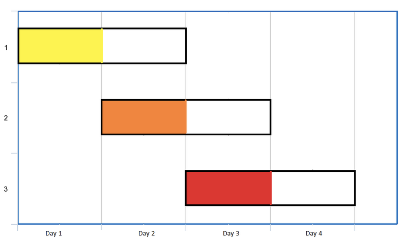

## Problem Explanation
This leetcode problem asks you to evaluate a list of date ranges representing events 
to determine the maximum number of events that you could go to.
The constraints are simple, each event can only be attended once and you can attend one event per day.
They provide this nice diagram which illustrates an example list of date ranges for a human to
evaluate the number of events which could be attended. The list is [[1,2],[2,3],[3,4]].

{: width="300" hight="100"}
_Visualization of Events [[1,2], [2,3], [3,4]]_

With this diagram, a human can easily figure out the maximum number of events that can be attened is all 3.
For more events where there is potentially more overlap, you would prioritize going to events with
smaller date ranges/days which have fewer events to maximize the number of events you can go to.
Applying this kind of logic ended up being difficult for me.
Enough so that I threw in the towel and decided to just look at the answer.

## Attempts to Solve
My idea to solve the problem was to use a hash map to count the frequency of days and ultimately 
have my answer be the number of days minus the days difference of the number days and number of events.
I accomplished this by iterating over the events and getting the date range for the event,
then iterating over that range and use the day as a key and increase the value if I had seen the key before.
This fails because the approach does not actually remove availablity for date ranges, 
i.e. if a range is [1,6] it will try to go to the event every day.

So, then I tried to keep track of the ranges in a hash map as well with the date range as the key,
that way I can return the number of days if there are fewer days than events,
or that number minus the discrepancy of days and events.
This still might not have worked, 
but the code will not compile because a hash map has to have keys which are hashable.
An array is not hashable in C++ unless you make your own function to do it.
I kept trying to figure out how to represent the list in the human readable way where my idea was to
find a day with only one possible event and remove that day and the whole event until I ran out of events or days.
But I couldn't hack it and the solution has a different approach.

## The Given Solution
The solution that is explained in the editorial is to use a min-heap as the key data structure and a greedy strategy.
A min-heap is a binary tree where the root node is the smallest value in the tree and each child has a value equal
or larger than its parent.
The opposite ordering of a min-heap is a max-heap, but is not what was suggested in the solution.
The reason we want a min-heap is to iterate over the end days of available events to choose the event which ends soonest.
They sort the list by start date to begin with.

### Order of Operations
To start, we sort the event ranges by start date, that way we can easily find what the last day is 
(i.e., second number in the last range).
Next, we iterate over the start days and add all events who start on that day, `i`; 
so the heap contains the events which can be attended on day `i`.
Before we move to the next day, we remove the events whose end days are less than (before) day `i` as they can't be attended.
If the heap is not empty after we remove those events and before we move on to the next day, 
we pop the root of the heap and increase our count for the answer;
this represents choosing one event to go to on that day `i`.
Finally, you move on to the next day and repeat those steps.

### Code in C++
```c++
#include<vector>
#include<queue>

int maxEvents(vector<vector<int>>& events) {
    int n = events.size(); // keep track of # events
    int lastDay = 0;
    // iterate through the events and update the last day
    for(int i = 0; i < events.size(); ++i) {
        lastDay = max(lastDay, events[i][1]);
    }
    // initialize heap as priority queue made up of integers stored in a vec 
    // 'greater' compares new elements which are emplaced making it a min-heap
    priority_queue<int,vector<int>,greater<int>> pq;
    sort(events.begin(), events.end());
    int ans = 0;

    for (int i = 0, j = 0; i <= lastDay; ++i) {
        while(j < n && events[j][0] <= i) {
            pq.emplace(events[j][1]);
            j++;
        }
        while(!pq.empty() && pq.top() < i) {
            pq.pop();
        }
        if (!pq.empty()) {
            pq.pop();
            ans++;
        }
    }

    return ans;
}
```